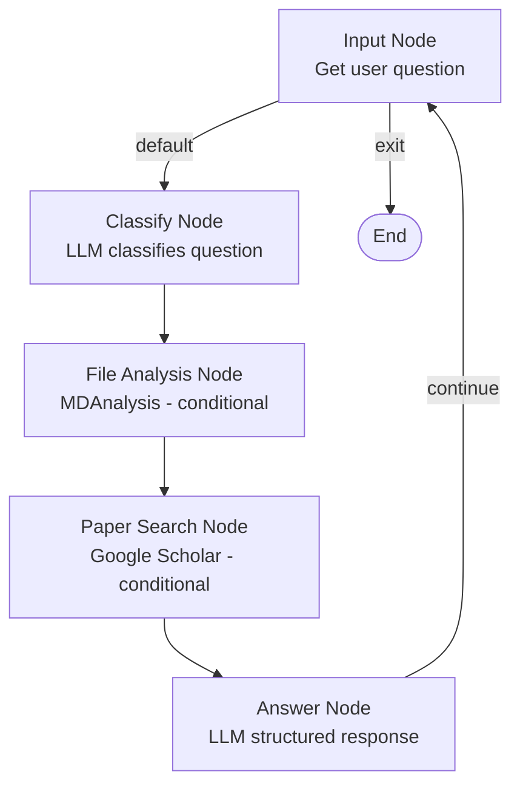

# Design Doc: MD Simulation Q&A Agent

> Please DON'T remove notes for AI

## Requirements

The agent is a CLI-based Q&A assistant for molecular dynamics (MD) simulations. It targets researchers using GROMACS, AMBER, NAMD, or OpenMM.

**User stories:**
- As a researcher, I point the agent to my simulation directory at startup, then ask questions in a loop until I type `quit`.
- As a researcher, I ask "Why is my RMSD drifting after 50ns?" and receive a structured answer: what the trajectory data shows, relevant papers, and suggested next experiments.
- As a researcher, I ask a theory question ("What is the optimal timestep for protein simulations?") and get an answer with references — no file analysis needed.
- As a researcher, the agent remembers my previous questions within the session so I can ask follow-ups without repeating context.

**Scope:** MD-specific only (GROMACS, AMBER, NAMD, OpenMM). All MD files remain local — only text (questions, analysis summaries) is sent to the LLM.

---

## Flow Design

> Notes for AI:
> 1. This is a **Workflow + Agent loop** pattern: a fixed pipeline per question, looped until the user exits.
> 2. Branching is handled internally in each node (checking shared flags) to keep the flow linear and simple.

### Applicable Design Pattern:

**Workflow** with a session loop: each question goes through a fixed pipeline (classify → analyze → search → answer), then loops back for the next question. Conditional steps (file analysis, paper search) are gated by flags set during classification.

### Flow High-level Design:

1. **InputNode**: Prompt the user for a question via CLI. If `quit`, exit the loop.
2. **ClassifyNode**: LLM classifies the question type and sets flags for whether file analysis and/or paper search are needed.
3. **FileAnalysisNode**: If flagged, use MDAnalysis to extract relevant data from the simulation directory (RMSD, RMSF, energy, structure). Skips if not needed.
4. **PaperSearchNode**: If flagged, search Google Scholar for relevant papers. Skips if not needed.
5. **AnswerNode**: LLM generates a structured response (Analysis / References / Next Steps) using question, file data, papers, and conversation history.



---

## Utility Functions

> Notes for AI:
> 1. Only the necessary utility functions for the nodes above.
> 2. All file I/O stays local — never pass raw file bytes to LLM, only text summaries.

1. **Call LLM** (`utils/call_llm.py`)
   - *Input*: `prompt` (str), `conversation_history` (list of dicts, optional)
   - *Output*: response (str)
   - Uses Claude API (`claude-sonnet-4-6`). Used by ClassifyNode and AnswerNode.

2. **Analyze MD Files** (`utils/analyze_md.py`)
   - *Input*: `work_dir` (str), `analysis_targets` (list of str, e.g. `["rmsd", "rmsf", "energy"]`)
   - *Output*: dict with analysis results as text summaries and numeric arrays
   - Uses MDAnalysis to load topology + trajectory from `work_dir`. Detects file formats automatically (GRO/PSF/PDB + XTC/DCD/TRR). Returns human-readable summaries only (no raw arrays sent to LLM).

3. **Search Papers** (`utils/search_papers.py`)
   - *Input*: `query` (str), `max_results` (int, default 5)
   - *Output*: list of dicts `[{title, authors, year, url, abstract_snippet}]`
   - Uses the `scholarly` library to query Google Scholar. Note: `scholarly` can be rate-limited or blocked; implement a simple retry with backoff.

---

## Node Design

### Shared Store

> Notes for AI: Try to minimize data redundancy. `conversation_history` carries context across the session loop.

```python
shared = {
    # Set once at startup
    "work_dir": "",                    # Path to the user's simulation directory

    # Session state (persists across questions)
    "conversation_history": [],        # List of {"question": str, "answer": str}

    # Per-question state (overwritten each iteration)
    "current_question": "",
    "question_type": "",               # "trajectory_analysis" | "setup_config" | "theory" | "troubleshooting" | "results_interpretation"
    "needs_file_analysis": False,
    "needs_paper_search": False,
    "analysis_targets": [],            # e.g. ["rmsd", "rmsf", "energy"]

    # Intermediate results (overwritten each iteration)
    "file_analysis": None,             # Dict from analyze_md, or None
    "papers": [],                      # List of paper dicts, or []

    # Final output (overwritten each iteration)
    "answer": {
        "analysis": "",
        "references": [],
        "next_steps": []
    }
}
```

### Node Steps

> Notes for AI: All nodes are Regular (sync). No Batch or Async needed given file sizes and serial CLI interaction.

1. **InputNode**
   - *Purpose*: Prompt the user for a question; handle session exit.
   - *Type*: Regular
   - *Steps*:
     - *prep*: Read `conversation_history` from shared (to display turn count if desired)
     - *exec*: Print prompt, read user input from stdin. Return the raw input string.
     - *post*: If input is `quit`/`exit`, return action `"exit"`. Otherwise write `current_question` to shared and return `"default"`.

2. **ClassifyNode**
   - *Purpose*: Use LLM to determine question type and which tools are needed.
   - *Type*: Regular
   - *Steps*:
     - *prep*: Read `current_question` and last 3 entries of `conversation_history` from shared.
     - *exec*: Call LLM with a classification prompt. Ask it to return YAML with fields: `question_type`, `needs_file_analysis` (bool), `needs_paper_search` (bool), `analysis_targets` (list). Parse and validate the YAML. Retry on parse failure (max_retries=3).
     - *post*: Write `question_type`, `needs_file_analysis`, `needs_paper_search`, `analysis_targets` to shared. Return `"default"`.

3. **FileAnalysisNode**
   - *Purpose*: Run MDAnalysis on the simulation directory if the question requires it.
   - *Type*: Regular
   - *Steps*:
     - *prep*: Read `needs_file_analysis`, `work_dir`, and `analysis_targets` from shared.
     - *exec*: If `needs_file_analysis` is False, return None immediately. Otherwise call `analyze_md(work_dir, analysis_targets)`. Do not catch exceptions here — let Node retry handle failures.
     - *post*: Write result to `file_analysis` in shared (or leave as None). Return `"default"`.

4. **PaperSearchNode**
   - *Purpose*: Search Google Scholar for papers relevant to the question.
   - *Type*: Regular
   - *Steps*:
     - *prep*: Read `needs_paper_search` and `current_question` from shared.
     - *exec*: If `needs_paper_search` is False, return empty list immediately. Otherwise call `search_papers(current_question, max_results=5)`.
     - *post*: Write results to `papers` in shared. Return `"default"`.

5. **AnswerNode**
   - *Purpose*: Generate the final structured answer using all gathered context.
   - *Type*: Regular
   - *Steps*:
     - *prep*: Read `current_question`, `question_type`, `file_analysis`, `papers`, and `conversation_history` from shared.
     - *exec*: Call LLM with a structured answer prompt. Ask it to return YAML with sections: `analysis` (str), `references` (list of citation strings), `next_steps` (list of str). Parse and validate YAML.
     - *post*: Write structured answer to `answer` in shared. Append `{"question": current_question, "answer": formatted_answer}` to `conversation_history`. Print formatted answer to CLI. Return `"continue"`.
