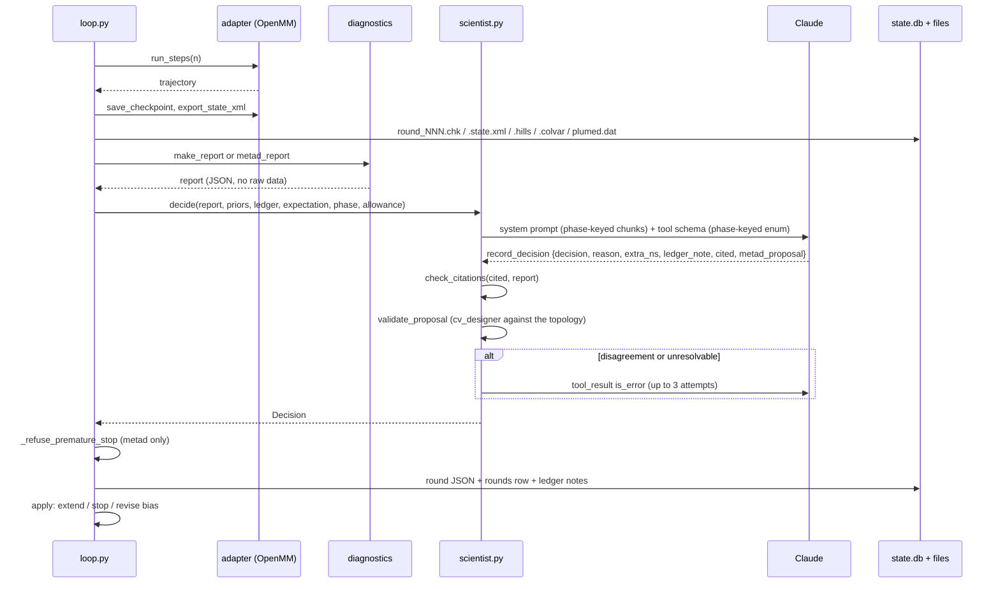

# MDPilot — how the agent works, what it measures, and where it is weak

A detailed picture of the agent as it exists on 2026-09-22. `architecture.md`
says why it is shaped this way and `diagrams.md` gives the whiteboard version;
this document is the long form: every component, every statistic the agent
reads, exactly how a free-energy surface is judged *correct* rather than merely
*converged*, and an honest list of the places the approach can be fooled.

Line references are to the code at the time of writing. When in doubt, the
code wins.

---

## 1. What the agent is

MDPilot is a closed-loop *outer* loop for molecular dynamics. Given a task
file — one system, one observable, two named states on that observable, a
budget — it runs a simulation, judges the result, and decides what to run
next: more of the same, stop, or switch to enhanced sampling on a collective
variable (CV) it chooses. It keeps deciding until the diagnostics say the
question is answered or the budget is spent.

Two things make it different from an MD "operator" agent:

- **The LLM is called exactly once per round, and once per campaign before
  the loop.** It never drives a simulation tool. It returns a structured
  decision through a strict tool schema; deterministic Python does everything
  with a physical unit attached.
- **The agent is judged on a coordinate it does not control.** The task file
  fixes the *campaign observable* and two thresholds on it. The agent may bias
  any CV it likes; success is always counted on the observable, so a wrong CV
  cannot make itself look right.

---

## 2. The whole campaign, as a diagram

```mermaid
flowchart TD
    %% ------------------------------------------------------------ setup
    subgraph SETUP["Before the loop — one LLM call, then humans and code"]
        REQ["Researcher's request<br/>'sample CLN025 folding at 300 K'"]
        SA{"setup_agent.py — LLM call, once per campaign<br/>strict tool use → typed proposal<br/>retried with the loader's own error"}
        YAML["task file (YAML)<br/>system · force field · observable ·<br/>two states · timescale + source · budgets"]
        HUMAN{{"Human review<br/>nothing runs until a person reads this"}}
        LOAD["task_file.py<br/>mapped / verified / informational fields<br/>unknown key → refuse<br/>renders task_expectation from typed fields"]
        REQ --> SA --> YAML --> HUMAN --> LOAD
    end

    %% ------------------------------------------------------------ build
    subgraph BUILD["Build — deterministic"]
        SPEC["SystemSpec + Ensemble"]
        ADAPT["MDAdapter<br/>OpenMM (bias-capable) · GROMACS (vanilla)"]
        PREP["prepare + start<br/>PDBFixer → solvate → ions → minimize<br/>NVT heat ramp → NPT relax<br/>cached System + State"]
        PRE["preflight.py<br/>residue count vs description<br/>observable magnitude vs state bands"]
        LOAD --> SPEC --> ADAPT --> PREP --> PRE
    end

    %% ------------------------------------------------------------ vanilla
    subgraph VAN["Phase: vanilla — unbiased MD"]
        VSIM["run_steps<br/>opening round, then extensions"]
        VCK["checkpoint + State snapshot<br/>then SQLite row"]
        VDIAG["make_report (no LLM)<br/>observable series → block-averaged SEM,<br/>Geyer τ_int + ESS, Sarle bimodality"]
        VDEC{"scientist.decide<br/>tool enum: extend · stop · switch_to_metad*"}
        VSIM --> VCK --> VDIAG --> VDEC
        VDEC -->|extend, clamped to max_extra_ns| VSIM
    end

    %% ------------------------------------------------------------ pivot
    subgraph PIV["Pivot / revision — deterministic"]
        VAL["proposal validated against the topology<br/>before the round is committed<br/>(3 attempts, error fed back to the model)"]
        CVD["cv_designer<br/>selection strings → atom indices<br/>distance · torsion · gyration · rmsd · contacts"]
        BD["bias_designer<br/>SIGMA = spread/3 with floors + ceilings<br/>HEIGHT = 0.5 kT · PACE 500 · γ = 10<br/>upper wall for length CVs"]
        PW["plumed_writer<br/>METAD (one CV) or PBMETAD + grids (2–3 CVs)<br/>observable printed unbiased in COLVAR<br/>absolute FILE= paths, FLUSH, RESTART"]
        WARM["biased adapter over the same spec<br/>warm-started from the walker's State"]
        VAL --> CVD --> BD --> PW --> WARM
    end

    %% ------------------------------------------------------------ metad
    subgraph MET["Phase: metad — well-tempered metadynamics"]
        MSIM["run_steps under PLUMED<br/>budget meter: cumulative biased ns"]
        MCK["checkpoint + State + HILLS/COLVAR/plumed.dat snapshot<br/>then SQLite row"]
        MDIAG["metad_report (no LLM)<br/>sum_hills → drift, basins, depth<br/>recrossings on the task states<br/>per-round range · confinement · absence<br/>reweighted F(observable) → ΔG"]
        MDEC{"scientist.decide<br/>tool enum: extend · stop ·<br/>switch_cv · add_cv (while allowance remains)"}
        MSIM --> MCK --> MDIAG --> MDEC
        MDEC -->|extend| MSIM
    end

    %% ------------------------------------------------------------ guards
    subgraph GUARD["Code overrules the model"]
        G1["cited values checked against the report<br/>misquote → sent back; 3 strikes → extend, note withheld"]
        G2["stop refused unless precision.gate is true<br/>AND no falsifier is refuted or not_evaluable<br/>(or the budget is spent)"]
        G3["budget caps, extension clamps, switch allowance<br/>all recounted from disk on resume"]
        G4["config lock: seed, spec, engine, expectation,<br/>thresholds, min_recrossings, wall, bias shape"]
    end

    %% ------------------------------------------------------------ end
    subgraph END["After the loop"]
        DONE(["campaign ends<br/>scientist_said_stop · max_rounds ·<br/>biased_budget_exhausted · switch_to_metad_requested"])
        VER["run_cln025_e2e.py verdict<br/>pivot evidence · self-correction · F(observable)<br/>vs independent reference · vs literature"]
        DONE --> VER
    end

    PRE --> VSIM
    VDEC -->|stop| DONE
    VDEC -->|switch_to_metad| VAL
    WARM --> MSIM
    MDEC -->|stop, if allowed| DONE
    MDEC -->|switch_cv / add_cv| VAL
    GUARD -.->|constrains| VDEC
    GUARD -.->|constrains| MDEC
```

Shapes: a **rotated square** is an LLM call — there are exactly three in a
campaign, the setup agent once and the scientist once per round; a
**hexagon** is a human; a **rectangle** is deterministic code; a **rounded
box** is a terminal state.

`*` `switch_to_metad` exists in the enum only when the task file declared an
expectation with a characteristic timescale. A pure convergence task cannot
pivot, by schema.

### One round, with the guard rails in order

---

## 3. The components, in words

### 3.1 Setup agent (`setup_agent.py`, `knowledge/setup_role.md`, `forcefield_guide.md`)

One LLM call, before any compute. It turns a one-line request into a typed
proposal (PDB id, force-field key from a closed vocabulary, temperature,
observable, two named states with thresholds, characteristic timescale with a
cited source, budgets). The module renders the YAML, so a syntactically
invalid task file is unrepresentable; semantic refusals from the loader are
fed back as a tool error and the model tries again. There is deliberately no
field for the CV to bias — that is the scientist's judgment later, not the
setup agent's.

### 3.2 Task file and loader (`task_file.py`)

Every field is *mapped* (becomes a real parameter), *verified* (not tunable
yet, but checked against the constant that governs it — a declared 1.0 nm
cutoff against a 1.2 nm adapter raises), or *informational*. The
`task_expectation` string the scientist reads is **rendered** from the typed
`expectation:` and `done_criterion:` blocks, including the computed
budget-to-timescale ratio, so the prose cannot drift from the numbers.

### 3.3 Adapters (`adapters/`)

`MDAdapter` is a small Protocol: `prepare`, `start`, `run_steps`,
`save_checkpoint`, `load_checkpoint`, plus `topology_path`,
`trajectory_extension`, `timestep_fs`, `temperature_k`. OpenMM implements it
fully, including a `PlumedForce` hook and portable State export for warm
starts; GROMACS implements the vanilla half. Force fields are a closed table
of validated protein+water pairs (`forcefields.py`); a pair that is not listed
is refused, never substituted.

### 3.4 The loop (`orchestrator/loop.py`)

A mechanical state machine: simulate → checkpoint → diagnose → decide → apply.
It owns the budget meters, the resume logic, the pivot and revision mechanics,
and the overrides that refuse a decision the data does not support. Commit
order per round is checkpoint, then bias snapshot, then diagnostics, then the
SQLite row — a crash after the MD but before the row is a re-run, not a
corruption.

### 3.5 The scientist (`orchestrator/scientist.py`, `knowledge/*.md`)

The single LLM call per round. The system prompt is assembled from Markdown
chunks keyed on the same facts that select the tool schema (phase, can it
propose a CV, does it still have a revision left), so the model never reads a
rule for an action it cannot emit. Its output is one `record_decision` tool
call. Every number it claims to have read (`cited`) is checked against the
report before the decision is accepted; a misread number is sent back with
both values, and three misreads convert the round to an extend with the
model's ledger note withheld.

### 3.6 Memory (`memory/store.py`)

One SQLite file per campaign (`campaign` config row, `rounds`, `ledger`) plus
per-round JSON, checkpoints, State XML, per-round observable series
(`.obs.npy`) and per-round snapshots of HILLS/COLVAR/plumed.dat. The
scientist's context each round is: this round's report, a compact summary of
every prior round, and the ledger notes it wrote itself. Nothing large ever
enters the model's context.

---

## 4. The statistics, exactly

### 4.1 Vanilla phase — is unbiased sampling adequate?

All computed on the campaign observable series (one value per trajectory
frame), by `diagnostics/report.py`:

| statistic | method | how it is read |
|---|---|---|
| `sem_blocked`, `plateau_reached`, `statistical_inefficiency_block` | Flyvbjerg–Petersen block averaging. Adjacent frames are averaged repeatedly; the SEM at each level is tracked with its own error bar. A plateau is three consecutive levels whose SEM spread is within 2× the largest error bar. g = (SEM/SEM_naive)² | `plateau_reached=false` means the correlation time is not resolved by the run |
| `tau_int_frames`, `ess`, `statistical_inefficiency_autocorr`, `well_sampled` | Geyer's initial positive sequence estimator of the integrated autocorrelation time; ESS = n / (2 τ_int) | the prompt's stop rule requires ESS ≥ 50; the two inefficiency estimates should agree within 2× |
| `bimodality_coefficient`, `n_basins`, `minor_basin_occupancy`, `exploring` | Sarle's BC = (skew² + 1) / (kurtosis + 3(n−1)²/((n−2)(n−3))). BC > 5/9 ≈ 0.555 → bimodal; then a 1-D 2-means split must give the minor basin ≥ 5 % of frames | `exploring=true` means unbiased MD is visiting more than one state on its own |

Decision rule the scientist is given (`phase_vanilla.md`):

- `exploring=true` → judge convergence: `plateau_reached AND well_sampled AND
  ess ≥ 50` → stop, else extend.
- `exploring=false` and the task needs no transition → same convergence rule.
- `exploring=false` and the task requires a transition whose characteristic
  timescale the budget cannot reach (the ratio is computed in
  `task_expectation`) → `switch_to_metad`, with a CV proposal.

### 4.2 Bias design — the numbers the model never touches

`sampling/bias_designer.py`, sized from the previous round's trajectory:

- **SIGMA** = (spread of the CV over the trajectory) / 3, then clamped. Floors
  (the narrowest hill worth depositing): 0.02 nm for distance and gyration,
  0.05 nm for RMSD, 0.15 rad for torsions, 0.5 contacts (divided by the pair
  count for a fraction). Ceilings (the widest hill that still resolves the
  range): 0.2 nm, 1.0 rad, 2.0 contacts. A clamped width is recorded as a
  `# NOTE:` in `plumed.dat`. The floor exists because the pivot fires exactly
  when the CV looks pinned, which is when its measured spread is least
  trustworthy (F4).
- **HEIGHT** = 0.5 kT. **PACE** = 500 steps. **BIASFACTOR** γ = 10.
- **Upper wall** on every length-dimensioned CV: the task's
  `cv_upper_wall_nm`, or, if none, a position derived from where the solute
  would meet its own periodic image (F6, F11).
- **Parallel bias** (`add_cv`): PBMETAD, one bias per CV with a grid; hills on
  retained CVs are kept and read back with RESTART.

### 4.3 Biased phase — has the surface converged?

`diagnostics/free_energy.py`, `metad_report`, all from PLUMED's own outputs:

| statistic | method |
|---|---|
| free-energy estimates | `plumed sum_hills --stride` on the cumulative HILLS → a surface every *stride* hills, re-zeroed to its minimum |
| `fes_drift_kj_per_mol` | max \|ΔF\| between the half-way estimate (index `min(n//2, n−2)`, so never the final one) and the final estimate, over the full grid. Consecutive estimates are deliberately not compared: they are a fraction of a percent of the run apart and barely differ however unconverged the surface is (F10) |
| `n_basins_fes`, `barrier_kj_per_mol`, `fes_depth_kj_per_mol` | minima with ≥ 1 kT prominence; barrier between the two deepest; depth restricted to the range COLVAR actually visited, not the grid padding (F7) |
| `cv_min`, `cv_max`, `cv_start` | range the walker visited over the whole biased phase, and where it started |
| `recrossings`, `recrossing_low`, `recrossing_high`, `recrossing_basis` | transitions counted **with hysteresis on the campaign observable between the task's two thresholds**, cumulative across every biased round and across a CV change. Anchored to the task, not to the surface's own basins, because the latter migrate as the bias fills (F9). `null`, not 0, when unmeasurable |
| `fes_converged` | `drift < kT AND recrossings ≥ min_recrossings` — 2 by default, i.e. a full round trip so the reverse barrier is sampled too |
| `observable_min_this_round`, `observable_max_this_round` | where the walker was *this* round, since the cumulative range hides a stalled walker (F13) |
| `confined_to_state`, `rounds_confined` | consecutive rounds whose per-round range sat entirely inside one state |
| `rounds_since_{low,high}_visited`, `ns_since_{low,high}_visited` | consecutive rounds, and the biased nanoseconds they hold, in which the walker never entered that state (F15). The prompt's revision trigger is ≥ 8 ns away from the starting state while `fes_depth` keeps rising |
| `observable_fes_path`, `delta_g_low_minus_high_kj_per_mol` | see §4.4 |
| `biased_cvs`, `cv_ranges`, `cv_switches_used/remaining` | which coordinates are biased, the range each covered, and the revision allowance left |

The stop rule is enforced in code, not only in the prompt: a `stop` while
`fes_converged` is not `true` is converted to an extend and written to the
ledger as a refusal (`_refuse_premature_stop`).

### 4.4 Correct, not just converged — three layers

> **Superseded 2026-09-22.** This section describes the agent before the
> validity / precision / correctness reframing. The current design is in
> `falsifiers.md`: the three "layers" below became three report blocks, and
> the in-loop checks became falsifiers that can only refute. Kept for the
> record of why.

*Converged* means the estimate stopped moving. It says nothing about whether
it stopped at the right answer. A bias that fills a degenerate basin the CV
cannot lead the walker out of produces a surface that stops changing and is
wrong by tens of kJ/mol (F13, D10). MDPilot therefore judges correctness on
three progressively more external yardsticks.

**Layer 1 — internal, every round.** The `fes_converged` gate above, plus the
per-round signals that catch the two known ways a surface converges to the
wrong thing: a walker parked in one state (`rounds_confined`) and a walker
roaming without returning (`ns_since_*_visited`). These feed the scientist's
`switch_cv` / `add_cv` decision, which is the agent's own correction
mechanism.

**Layer 2 — the surface on the observable, reweighted.** Whatever CV is
biased, PLUMED prints the campaign observable on every COLVAR row next to the
bias V acting at that moment. `reweighted_profile` builds
F(observable) = −kT ln Σ w over a histogram with weights w = exp(V/kT)
(instantaneous bias, no c(t) offset; empty bins dropped). From it,

ΔG(low − high) = −kT ln [ ∫_{high state} e^{−F/kT} / ∫_{low state} e^{−F/kT} ],

integrated over the two task states rather than read off two minima. This is
the number that survives a CV switch: after a `switch_cv` the HILLS surface is
on a different coordinate, but the reweighted observable surface is
comparable across the whole biased phase. When the biased CV *is* the
observable, the scorer prefers its own `sum_hills` marginal (five times more
samples, and the reweighted one only sees COLVAR written since the last
revision).

**Layer 3 — the verdict, after the campaign** (`benchmarks/run_cln025_e2e.py`).

1. *Did it pivot on the evidence?* The vanilla report at the pivot round is
   recorded (`exploring`, `n_basins`, BC, ESS, the CV and the reason).
2. *Did it correct itself, and on what?* Every `switch_cv`/`add_cv` with the
   signals it cited, and every loop refusal.
3. *Is the surface right?* F(observable) from the last biased round is
   compared with an **independent reference**: the same method, same force
   field, same bias designer, a different seed, run by
   `generate_cln025_reference.py` until it passes its own stricter
   stationarity test — drift over the *last fifth* of the run < kT over the
   task-relevant range (the two states ± half a band), the reweighted ΔG over
   the last half within kT of the whole-run value, and ≥ 4 transitions —
   checked every 10 ns up to a 200 ns ceiling, and written only when it
   passes. A campaign **matches** when, over the range both sampled and after
   re-zeroing each to its own minimum, rms(F_campaign − F_reference) ≤ 1 kT
   and \|ΔG_campaign − ΔG_reference\| ≤ 1 kT.
4. *Is it nature's surface?* ΔG(unfolded − folded) is compared with the
   literature band for the system (0 to 10 kJ/mol for CLN025 at 300 K,
   Honda 2008). **Reported, not gated** — a force field's disagreement with
   experiment is not the agent's doing.

Verdict: `PASS` needs the pivot *and* a match against a converged reference.
`INCOMPLETE` when there is no reference or the reference could not converge —
which is what every ff14SB/TIP3P attempt produced. `FAIL` otherwise.

---

## 5. Weaknesses

Stated as they stand, with the finding or review that surfaced each.

### 5.1 In the judgment of correctness

- **The reference shares the method's blind spots.** It is generated by the
  same well-tempered metadynamics, the same bias designer, and a CV from the
  same vocabulary. If the coordinate family is non-ergodic for the system —
  as every 1-D CV was for CLN025 refolding — the reference does not converge
  and the verdict is `INCOMPLETE`, which is honest, but a reference that
  converges to the *same wrong* surface as the campaign would produce a
  `PASS`. Independence is a different seed, not a different method.
- **Drift plus recrossings is a necessary test, not a sufficient one.** A
  bias filling a degenerate bin stops moving; two grazes of a threshold count
  as two transitions. The per-round trap signals exist because this gate was
  passed by wrong surfaces (F13, F15). They fire late — the absence signal
  needs ~8 ns — and only on the two failure shapes seen so far.
- **The reweighting has no c(t) correction** and, over a long run, keeps few
  effective frames. Tested on a 1-D model it was within 0.2 kJ/mol of the
  rbias estimate, but it is an approximation, and no error bar is attached to
  ΔG. The wall's bias is not printed to COLVAR, so frames past a wall are
  reweighted as if the wall were physics.
- **No replicas, no kinetics.** One walker, one seed. ΔG carries no
  statistical uncertainty from repeats; rates are not estimated at all.
- **The literature band is hard-coded per benchmark.** Layer 4 is specific to
  CLN025 today.

### 5.2 In the diagnostics

- **Sarle's bimodality coefficient false-positives on right-skewed unimodal
  data** (gamma-shaped marginals with BC 0.58–0.63 pass both the cutoff and
  the occupancy gate). A folded protein's RMSD or Rg has exactly that shape,
  so a pinned system can read as `exploring=true` and the pivot is withheld.
- **The block-averaging plateau is optimistic on short, strongly correlated
  series** (AR(1) φ = 0.9, n = 2000: plateau declared every time with the SEM
  ~1.4× too small). The autocorrelation ESS on the same series is accurate,
  so the stop gate holds, but two numbers the scientist sees are softer than
  the prompt implies.
- **`trajectory_length_ns` on vanilla rounds is wrong unless a frame is 1 ps**
  (mdtraj fills a DCD's time axis with the frame index). A real 1 ns round was
  reported as 0.199 ns. This number feeds the budget-versus-timescale
  comparison. Open at the time of writing.
- **One observable, one scale.** Everything is judged on a single 1-D
  coordinate the task file chose. The state thresholds are positions on it;
  a poorly chosen observable (F12, F14) makes the done criterion unreachable
  and the pre-flight scale check cannot see the too-small direction.

### 5.3 In the sampling machinery

- **Multi-CV escalation meets single-CV guards.** Two walled length CVs
  render a duplicate PLUMED label and abort at init; the PBMETAD grid is a
  hard limit (a hill outside it is fatal); the SIGMA floor/ceiling audit
  notes are dropped on the parallel path. All three are reachable by the
  first `add_cv` on a task that carries a wall.
- **Bias parameters are heuristics.** SIGMA = spread/3 with fixed floors and
  ceilings, HEIGHT = 0.5 kT, γ = 10. γ = 10 flattens barriers up to ~10 kT;
  a deeper surface wants a larger one, and nothing measures that.
- **CV vocabulary is five types**, all on protein backbones. No path CVs, no
  learned coordinates, no ligand or lattice observables.
- **Bias runs on OpenMM only.** GROMACS has no PLUMED path and no State
  export, so a GROMACS campaign cannot pivot.

### 5.4 In the agent layer

- **The pivot rests on one number the model wrote.** The characteristic
  timescale comes from the setup agent with a cited source; if it is wrong,
  the budget comparison is wrong and the pivot decision follows it.
- **Citations are checked; reasoning is not.** The model can quote every
  number correctly and still draw the wrong conclusion. The overrides catch a
  premature stop and an unbuildable CV, not a wrong CV that builds.
- **Latency of self-correction.** The trap signals accumulate over rounds;
  on a 20 ns budget the escalation came at round 10 of 12 (2026-09-14
  campaign). The 100 ns budget in the current task file is a response to
  that, at five times the cost.
- **Resume windows.** The mid-round crash window after an `add_cv` can
  double-deposit retained hills (the revision-resume path does not restore the
  snapshot). Narrow, but it is exactly the class of error the snapshots were
  built to prevent.
- **Cost.** A converged reference is 100–200 ns of biased MD per force field
  and system; a campaign is tens of nanoseconds plus a Sonnet call per round.
  Fine for a mini-protein on one GPU; the M5 HPC layer does not exist yet.

### 5.5 What "sound" means here

None of this is hidden. The activity log records each of these as a numbered
finding with the campaign that exposed it, and the verdict says `INCOMPLETE`
rather than `PASS` when its yardstick is not trustworthy. The agent's real
contribution is the loop that noticed a coordinate was not bringing the system
back, said so with the numbers, and changed the plan — unattended. What it
cannot yet do is prove, from inside one campaign, that the surface it ends
with is the true one.

---

## See also

- `architecture.md` — principles and file map
- `diagrams.md` — the three whiteboard diagrams
- `activity-log.md` — every decision (D-series) and finding (F-series) cited above
- `../ROADMAP.md` — what is planned
